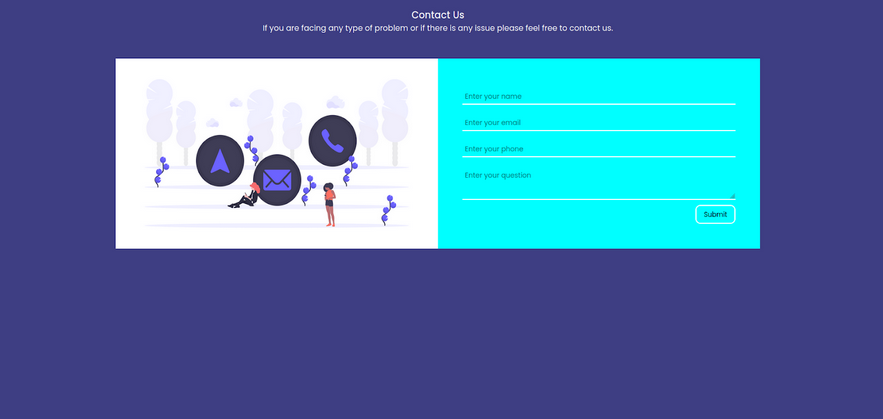
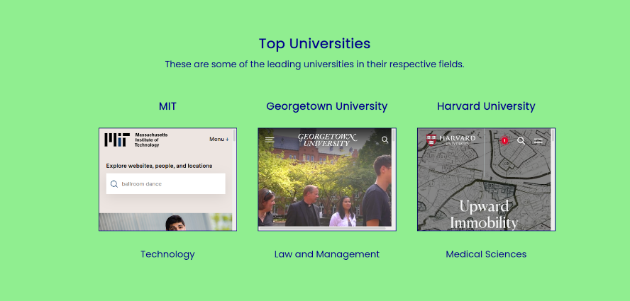
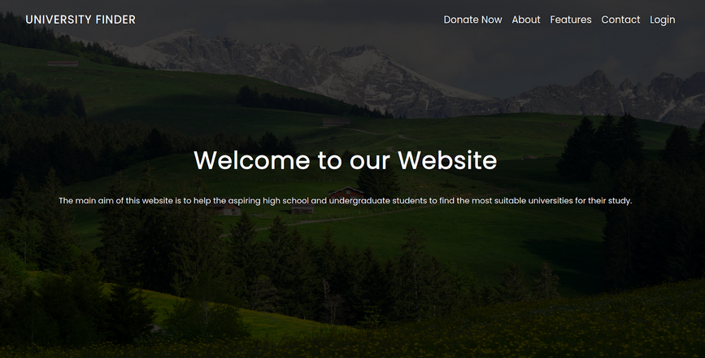
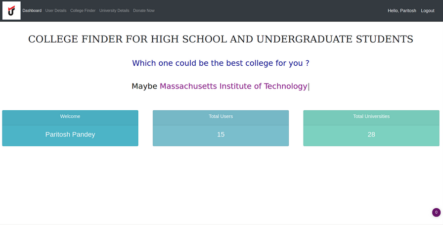
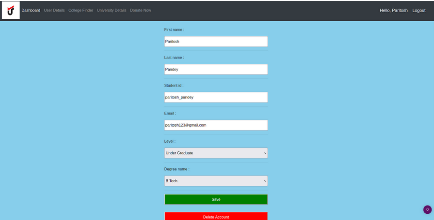
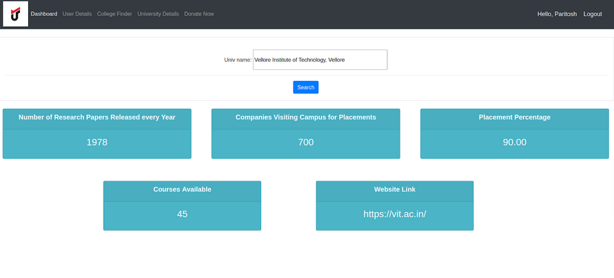
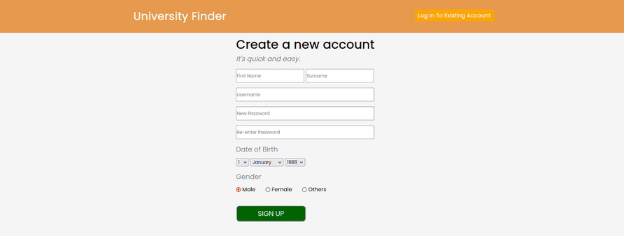

# University Finder

<i> Note: Please star the repo if you find this project useful. </i>

<hr>

### Introduction

<p align = "justify">
The aim of this project is the development of a sample centralized relational college finder website. This application has to store information of users and different colleges they aspire to get it. In this context, the functionality is to update, remove and insert variables for different entities of the list. The database is built for the user (student) from the college list column. Users can update their entries and preferences on any pc. The database is being designed to provide a user-friendly one-stop solution of college search. 
</p>

<p align = "justify">
Developed using Django, HTML, CSS and JS.
</p>

### How to run the application ?

```
git clone https://github.com/kaustubh0201/University-Finder.git
cd University-Finder
pipenv shell
# This will activate the python environment
pipenv install
python3 manage.py runserver
```

<i> Note: For exiting the python environment, use <code>exit</code> in the terminal. </i>

### Models

1. Level

```
level_code - IntegerField (primary_key)
level_name - CharField (choices = [High School, Under Graduate])
```

<hr>

2. Degree

```
degree_code - CharField (primary_key)
degree_name - CharField (max_len = 200)
level_code - Foreign_Key (Level)
```

<hr>

3. Student

```
first_name - CharField (max_len = 200)
last_name - CharField (max_len = 200)
student_id - CharField (primary_key)
email - EmailField (max_len = 200)
gender - CharFeild (max_len = 200)
password - CharField (max_len = 200)
level - Foreign_Key (Level)
degree_name - Foreign_Key (Degree)
```

<hr>

4. University

```
university_id - CharField (primary_key)
university_name - CharField (max_len = 200)
degree - CharField
course - CharField
level - CharField
location - CharField
website - CharField
```

<hr>

5. University_Info

```
univ_id - CharField (primary_key)
univ_name - CharField
research_paper - IntegerField
placement_percent - DecimalField
courses_available - IntegerField
comp_visit - IntegerField
avg_place_amt - DecimalField
high_place_amt - DecimalField
min_place_amt - DecimalField
web - CharField
```

<hr>

6. Suggestion

```
suggestion_code - IntegerField (primary_key)
topic1 - CharField (max_len = 200)
topic2 - CharField (max_len = 200)
topic3 - CharField (max_len = 200)
student_id - Foreign_Key (Student)
university_id = ManyToManyField (University) 
```

<hr>

7. University_Degree

```
univ_deg_id - IntegerField (primary_key)
univ_deg_name - CharField (max_len = 200)
university_id - Foreign_Key (University)
```

<hr>

8. Topics

```
topic - CharField (max_len = 200)
univ_deg_id - Foreign_Key (University_Degree)
```

<hr>

9. Courses

```
course - CharField (max_len = 200)
univ_deg_id - Foreign_Key (University_Degree)
```

<hr>

10. Donation Info

```
auto_increment_id - AutoField (primary_key)
email - CharField (max_len = 200)
first_name - CharField (max_len = 200)
last_name - CharField (max_len = 200)
street - CharField (max_len = 200)
zip_code - IntegerField
city - CharField (max_len = 200)
country - CharField (max_len = 200)
```

<hr>

### Web Pages

<p align = "center">

</p>

<p align = "center">Contact Us Section</p>

<hr>

<p align="center">

</p>

<p align = "center">Top Universities Section</p>

<hr>

<p align="center">

</p>

<p align = "center">Landing Page</p>

<hr>

<p align="center">

</p>

<p align = "center">Home Page</p>

<hr>

<p align="center">

</p>

<p align = "center">User Detail Updation Page</p>

<hr>

<p align="center">

</p>

<p align = "center">University Information Page</p>

<hr>

<p align="center">

</p>

<p align = "center">Sign Up Page</p>